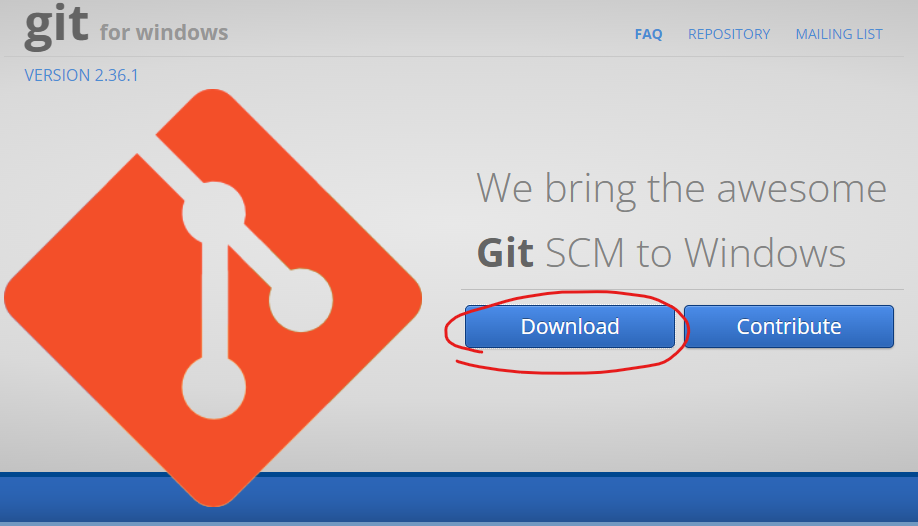

# Upreach Git & GitHub Training

# Git installation

You can refer to the installation guide here:
https://www.atlassian.com/git/tutorials/install-git

(you don't have to set up any of the username and password settings, we'll do that together)

I've also summarised it below, if you find that easier

## Windows

Install git from:
https://gitforwindows.org/ 


<figure>
    
    <figcaption>Please click on the download button on the website</figcaption>
</figure>

## Mac

### Git for Mac Installer [Default]

Download and install Git from https://sourceforge.net/projects/git-osx-installer/files/ 

After this, it should all be installed.

There are other ways to install Git - have a look below for other options.

### Only if you are using Homebrew

 ```shell
 $ brew install git
 ```


### Only if you are using MacPorts

 ```shell
 $ sudo port selfupdate
 $ port search git
 $ port variants git
 $ sudo port install git +bash_completion+credential_osxkeychain+doc
 ```

## After installation Steps

After you have installed Git (either on Mac or Windows), can you please check the installation by running the following?

```shell
$ git --version
```

You should get something like this (the actual version might be different to mine)

```shell
$ git --version

git version 2.36.0.windows.1
```

If the above command returns an error, then please restart your laptop.
If it still doesn't work, try installing it again.
Googling the error will also help (most likely other users would have gotten a similar issue too)

If all the above fails, reach out to your representative at Upreach or me.


